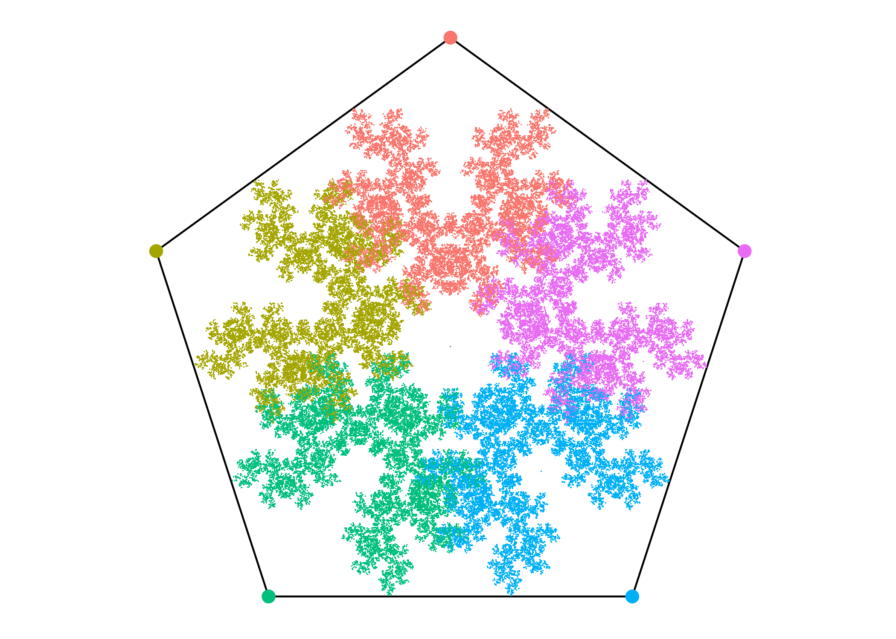

Pentagon Chaos Game
================

On this [wikipedia page](https://en.wikipedia.org/wiki/Chaos_game) I learned that if a point inside a pentagon repeatedly jumps half of the distance towards a randomly chosen vertex, but the currently chosen vertex cannot be the same as the previously chosen vertex, the point sequence yields a fractal. We will reproduce this below.

``` r
library(tidyverse)
source("poly_fractal_utils.R")
```

### Builds a 5-gon and generates mid-points

``` r
myN <-5
myV <- 1e5

polyDF <- list2DF(getVtx(myN))
midPts <- getMidPts(myV,myN) # slow
```

### Plot pentagon and locus of mid-points

``` r
polyDF %>% mutate(polyI=row_number()) %>%
  ggplot(aes(x=x,y=y)) +
  geom_polygon(fill=NA,color="black") +
  geom_point(aes(color=factor(polyI),size=I(3))) +
  geom_point(data=midPts,aes(x=x,y=y,color=factor(vtx)),
             shape=".") +
  coord_fixed() +
  theme(legend.position="none",
        axis.text = element_blank(),
        axis.title = element_blank(),
        axis.ticks = element_blank(),
        panel.grid = element_blank(),
        panel.background = element_rect(fill="white"))
```


